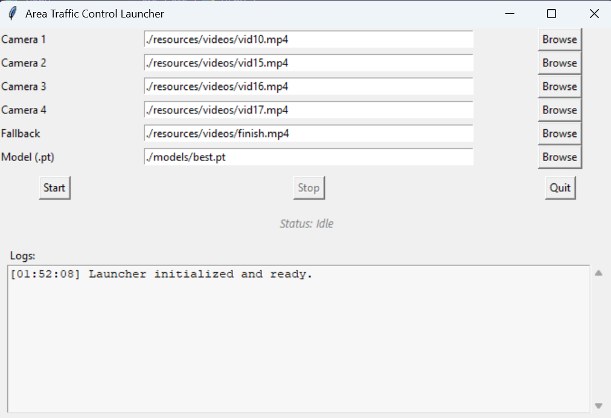
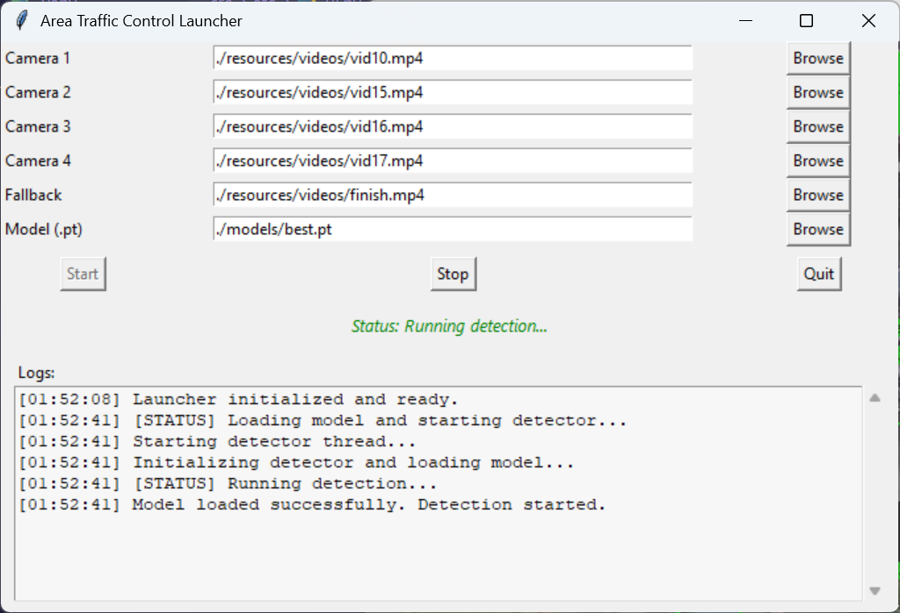
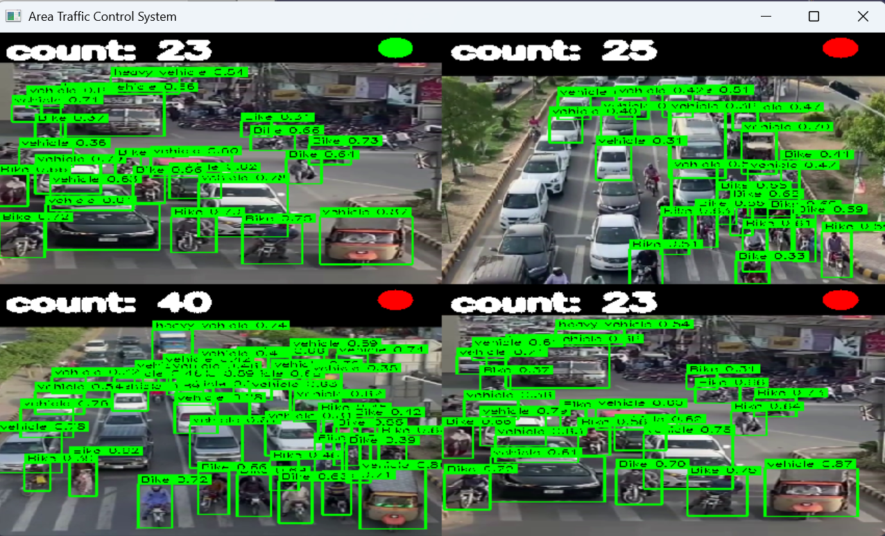
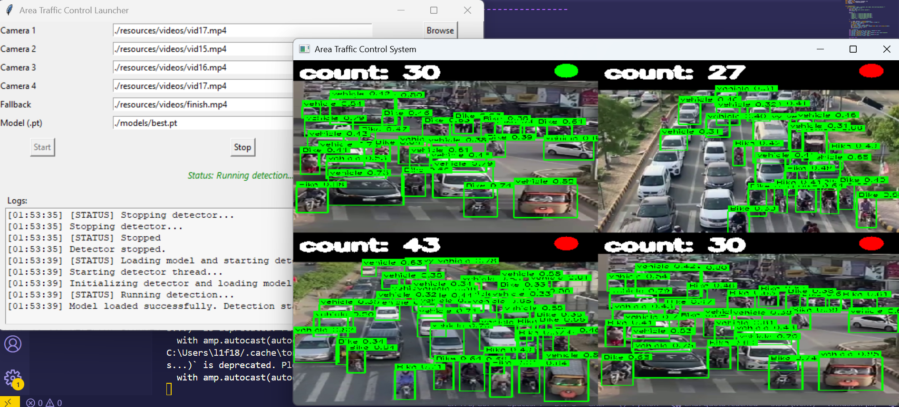
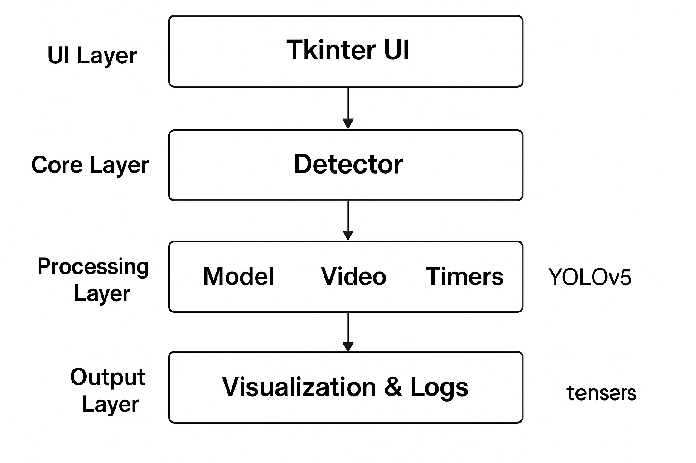

# 🚦 Area Traffic Control System

A smart **multi-camera traffic monitoring system** built with **YOLOv5**, **OpenCV**, and **Tkinter** — designed to analyze multiple video feeds, detect vehicles, and manage area-based traffic control logic.

---

## 🧩 Overview

The **Area Traffic Control System (ATC)** provides real-time monitoring of multiple camera feeds.  
It uses **YOLOv5 (via PyTorch)** for object detection and displays results through a simple **Tkinter-based launcher**.

You can:
- Load multiple video sources.
- Start/stop the detector.
- See live logs and system status.
- Control and analyze multiple traffic areas simultaneously.

---

## ✨ Features

✅ Multi-camera video processing  
✅ YOLOv5 vehicle detection  
✅ Real-time visualization with OpenCV  
✅ Tkinter launcher for easy use  
✅ Live status indicator and log viewer  
✅ Modular and extensible architecture  

---
🔧 2️⃣ Flow Diagram for Your Project

---
## 🧠 System Architecture

src/
└── atc/
    ├── __init__.py
    ├── model.py         → Loads YOLOv5 model
    ├── detector.py      → Main controller logic
    ├── video.py         → Video frame reading
    ├── scoring.py       → Model inference on frames
    ├── plotting.py      → Draws bounding boxes
    ├── timers.py        → Manages signal timers
    └── ui.py            → Tkinter GUI launcher

🧰 Tech Stack

Python 3.10+
PyTorch (for YOLOv5)
OpenCV (for video processing)
Tkinter (for GUI)
NumPy, Pandas, Ultralytics, TQDM, Seaborn

⚙️ Installation

Clone the repository:

git clone https://github.com/yourusername/area-traffic-control.git
cd area-traffic-control

Create and activate a virtual environment:

python -m venv venv
venv\Scripts\activate   # on Windows
source venv/bin/activate  # on macOS/Linux

Install dependencies:

pip install -r requirements.txt

Note: Install PyTorch using the official command for your system
(see pytorch.org/get-started
).

▶️ Running the Project
1️⃣ Launch the GUI
python -m src.atc.ui

2️⃣ From the Launcher:

Browse or set the camera video paths.

Select the fallback video and YOLO model (best.pt).

Click Start to begin detection.

Click Stop to pause or Quit to exit.

## 📸 Screenshots

### 🎛️ Application Launcher

### 🚦 Detection Example

### 🧩 System Flow

